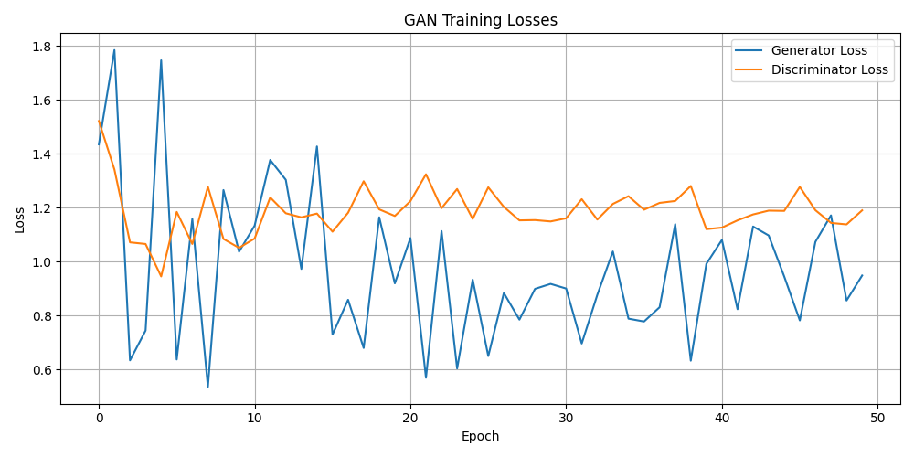

# DCGAN on MNIST

This repository contains a PyTorch implementation of a Deep Convolutional Generative Adversarial Network (DCGAN) trained on the MNIST dataset. It includes modular code for the generator and discriminator models, a training loop, and tools for loading and visualizing data.

## Project Structure

```
DCGAN_MNIST/
├── dataloader.py        # Loads and normalizes the MNIST dataset
├── models.py            # Generator and Discriminator model definitions
├── train.py             # Main training loop
├── plot_mnist.py        # Visualizes a batch of MNIST samples with their true labels
├── run_generator.py     # Generates images using the trained generator model
├── generator.pth        # Saved generator weights (after training)
├── discriminator.pth    # Saved discriminator weights (after training)
└── loss_curve.png       # Generator and discriminator loss over epochs
```

## Getting Started

### 1. Install dependencies

```bash
pip install torch torchvision matplotlib
```

### 2. Run the training

```bash
python train.py
```

### 3. Outputs

* `loss_curve.png`: A plot of generator and discriminator losses.
* `generator.pth`: Trained generator weights.
* `discriminator.pth`: Trained discriminator weights.

## Model Architecture

### Generator:

* Fully connected layers
* LeakyReLU activations
* Batch normalization
* Tanh output activation

### Discriminator:

* Fully connected layers
* LeakyReLU activations
* Sigmoid output activation

## Example Loss Plot

After training, a loss plot will be saved as `loss_curve.png`:



## Generating Specific Digits (Future Enhancement)

The current implementation uses an unconditional Generative Adversarial Network (GAN). This means the generator learns to produce images resembling the MNIST dataset but does not have a mechanism to generate a *specific* digit (e.g., only images of the digit "7"). The `run_generator.py` script will therefore produce random handwritten digit samples.

To enable the generation of specific digits (0-9), a Conditional GAN (cGAN) would need to be implemented. This involves the following main steps:

1.  **Modify Model Architectures (`models.py`):**
    *   **Generator:** The generator would need to accept a class label (representing the digit 0-9) as an additional input, along with the random noise vector. This label would typically be embedded and concatenated with the noise vector or incorporated at a later stage in the network.
    *   **Discriminator:** The discriminator would also need to accept the class label as an additional input, along with the image. It would learn to distinguish real images (and their correct labels) from fake images (and their purported labels).

2.  **Update Data Loading (`dataloader.py` or `train.py`):**
    *   The data loader needs to provide the labels along with the images during training.

3.  **Modify Training Loop (`train.py`):**
    *   Both the generator and discriminator would be fed the corresponding class labels during the forward passes.
    *   The loss functions might need adjustment to reflect the conditional nature of the task.

4.  **Train the cGAN Model:**
    *   The new cGAN model would need to be trained from scratch.

5.  **Update Generation Script (`run_generator.py`):**
    *   The script would be modified to accept a desired digit (0-9) as input.
    *   This label would be passed to the trained conditional generator to produce an image of that specific digit.

This enhancement would allow for more controlled and targeted image generation.

## References

* [GAN original paper (Goodfellow et al., 2014)](https://arxiv.org/abs/1406.2661)
* [DCGAN paper (Radford et al., 2015)](https://arxiv.org/abs/1511.06434)

## License

This project is licensed under the MIT License.
